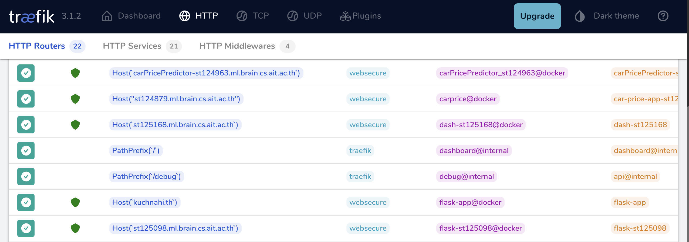

# Assignment: A2-Predicting-Car-Prices

Name: Neha Shrestha
Student ID: st124963

In this Assignment A2, 4 models (Polynomial, lasso, ridge and normal) are compared. Cross Validation was used to compare between Polynomial, lasso, ridge and normal. The best found model was Normal regression with method: 'mini_batch', polynomial': False, lr: 0.01, l: 0.1, weight: 'xavier', degree: 3, momentum: 0.0. 
Best MSE: 0.8789041439066244
Best R2: -0.24141675428458784 

This repository contains a web-based application that integrates a machine learning model using Dash. The project focuses on creating an aesthetically appealing user interface while maintaining robust functionality.

#### URL: 
The website is live at: carPricePredictor-st124963.ml.brain.cs.ait.ac.th


The file can be runned locally following the below steps:
1. After clonning the repository navigate to the project directory
2. Activate the virtual environment 
3. Install dependencies 
4. Run the dash application using:
```
python app/app.py
```

#### Screenshots



